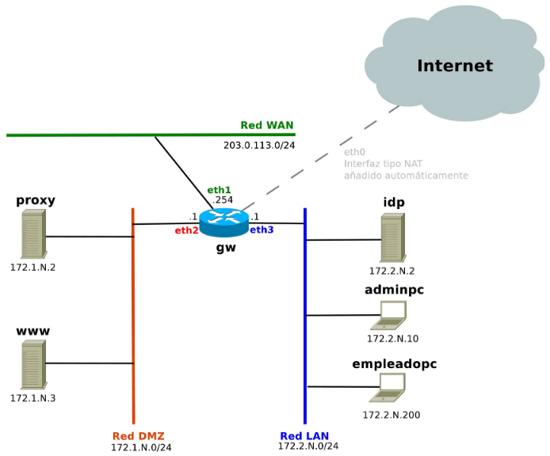
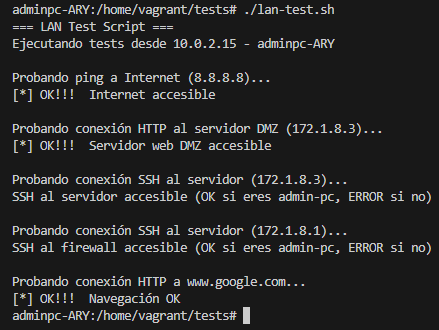
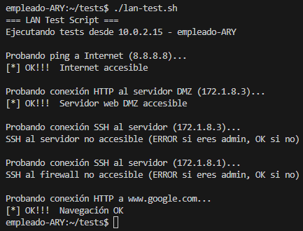
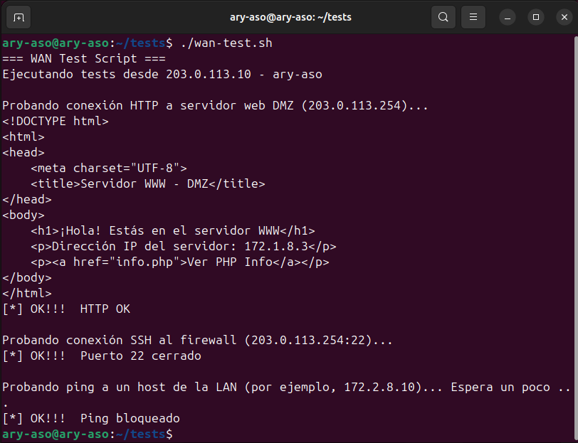

# Seguridad y alta disponibilidad - Práctica 5 - Cortafuegos con iptables

En esta práctica se implementa un cortafuegos con iptables en una arquitectura de red formada por WAN, DMZ y LAN, utilizando máquinas virtuales desplegadas con Vagrant y Virtualbox.

El objetivo es aplicar una política de seguridad restrictiva, donde todo el tráfico no permitido explícitamente es bloqueado.

## Topología de red

La red implementada consta de:

- GW (gateway/firewall): máquina central con iptables
- DMZ (172.1.X.0/24):
  - proxy
  - www (servidor web)
- LAN (172.2.X.0/24):
  - idp
  - adminpc
  - empleadopc
- WAN: acceso a Internet mediante NAT

El cortafuegos controla el tráfico entre redes y aplica reglas de filtrado.



## Estructura del repositorio

```bash
vagrantsad
├── adminpc
│   └── provision.sh
├── empleado
│   └── provision.sh
├── gw
│   ├── firewall
│   │   └── firewall.sh
│   └── provision.sh
├── idp
│   └── provision.sh
├── imagenes
│   ├── imagen1.png
│   ├── imagen2.png
│   ├── imagen3.png
│   ├── imagen4.png
│   └── imagen5.png
├── proxy
│   └── provision.sh
├── tests
│   ├── dmz-test.sh
│   ├── lan-test.sh
│   └── wan-test.sh
├── .gitignore
├── README.md
└── Vagrantfile
```

### Archivo clave
firewall.sh: contiene todas las reglas de iptables organizadas por bloques y comentadas según los requisitos de la práctica.

## Funcionalidad del cortafuegos

El cortafuegos implementa, entre otras, las siguientes medidas:

### Protección local (GW)
- Permite tráfico de loopback
- Permite ping desde DMZ y LAN
- Permite consultas DNS
- Permite HTTP/HTTPS hacia Internet
- Permite acceso SSH solo desde adminpc
- Política por defecto restrictiva

### Protección de la red
- SNAT para tráfico saliente
- DNAT para acceso HTTP desde Internet al servidor web de la DMZ
- Aislamiento entre DMZ y LAN con excepciones:
  - LAN → DMZ por HTTP
  - adminpc → DMZ por SSH
- Acceso completo a Internet desde LAN (solo conexiones iniciadas desde dentro)
- Acceso limitado a Internet desde DMZ (HTTP, HTTPS, DNS y NTP)

## Puesta en marcha

### Requisitos
- VirtualBox
- Vagrant

### Clonar el repositorio

```bash
git clone <URL_DEL_REPOSITORIO>
cd <nombre_del_repositorio>
```

### Levantar las máquinas

```bash
vagrant up
```

El proceso descargará las imágenes necesarias y configurará automáticamente las máquinas y el cortafuegos.

### Apagar y eliminar el entorno

Apagar las máquinas:

```bash
vagrant halt
```

Reiniciar aplicando cambios:

```bash
vagrant reload
```

Eliminar todas las máquinas:

```bash
vagrant destroy
```

### Comprobar el estado de las máquinas

```bash
vagrant status
```

### Acceder por SSH a una máquina

```bash
vagrant ssh <vm>
```

## Capturas de pruebas

### Pruebas desde la LAN 1: desde adminpc



### Pruebas desde la LAN 2: desde empleado



### Pruebas desde la WAN:



### Pruebas desde el www (DMZ):


